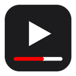

<div align="center">

  [](https://github.com/ans-ib/Minimal-Bar-for-YouTube/releases/latest)
  [](https://github.com/ans-ib/Minimal-Bar-for-YouTube/stargazers)
  [](https://github.com/ans-ib/Minimal-Bar-for-YouTube/graphs/contributors)
  [](https://github.com/ans-ib/Minimal-Bar-for-YouTube/actions/workflows/ci.yml)
  

</div>

<div align="center">

  

  # Minimal Bar for YouTube

  A browser extension for Chrome, Brave, Edge and other Chromium browsers, and for Firefox, that keeps a minimal progress bar on screen while YouTube's controls are hidden and lets you change the volume with the mouse wheel.

</div>

<div align="center">

  ## Download

  [](https://chromewebstore.google.com/detail/minimal-bar-for-youtube/oplglmmjagffpojanjhnjboogdokljld)
  [](https://microsoftedge.microsoft.com/addons/detail/minimal-bar-for-youtube/llcgbejikjgnfjobllkdmiekmkccdefd)

  Brave, Opera, Vivaldi and other Chromium browsers install from the Chrome Web Store.

  **Firefox Add-ons:** in review, coming soon. Until then, grab the Firefox zip from the [releases page](https://github.com/ans-ib/Minimal-Bar-for-YouTube/releases/latest) or [build it yourself](#build-it-yourself).

</div>

**Manual install in a Chromium browser:** unzip the `chromium` zip from the [releases page](https://github.com/ans-ib/Minimal-Bar-for-YouTube/releases/latest), open `chrome://extensions`, turn on **Developer mode**, click **Load unpacked** and pick the unzipped folder.

**Firefox (142 or newer):** open `about:debugging` → *This Firefox* → *Load Temporary Add-on* and pick the `firefox` zip. Temporary add-ons are removed when Firefox restarts; the store version will be permanent.

---

<div align="center">

  # Features

</div>

- **Minimal progress bar.** When YouTube hides its controls, a thin segmented progress bar (one segment per chapter) stays visible along the bottom edge of the player, with the current chapter name and the time in small labels. It fades out again the moment YouTube's own controls come back, and during ads.
- **Wheel volume.** Roll the mouse wheel anywhere over the video to change the volume in 5% steps. A small indicator shows the new level. Trackpads are smoothed so a swipe doesn't jump straight to 0 or 100, scrolling up from mute unmutes, and the new volume is remembered the next time YouTube opens.
- **Settings.** Click the toolbar icon to switch wheel volume off, make the bar thicker, or make the labels larger. Changes apply instantly and sync with your browser profile.

The extension drives YouTube's own player, so the native volume slider and mute button always stay in sync. It works in normal, theater and fullscreen modes.

**Privacy:** no data is collected or transmitted. There is no background process and no network access. The only thing stored is your three settings. It runs only on `www.youtube.com`.

---

<div align="center">

  # Build it yourself

</div>

### Prerequisites

- [Node.js](https://nodejs.org/) 20 or newer
- npm (comes with Node.js)

### Installation

```bash
# Clone the repository
git clone https://github.com/ans-ib/Minimal-Bar-for-YouTube.git
cd Minimal-Bar-for-YouTube

# Install dependencies
npm install
```

```bash
# Build and package for Chrome, Brave, Edge and other Chromium browsers
npm run package:chromium
```

```bash
# Build and package for Firefox
npm run package:firefox
```

The zips land in `web-ext-artifacts/`. To load the extension unpacked instead, run `npm run build:chromium` (or `build:firefox`) and point the browser at the `dist/` folder.

### Development

```bash
# Rebuild dist/ on every change
npm run watch

# Run the unit tests
npm test
```

After a rebuild, click the reload icon on the extension's card in `chrome://extensions`, then reload the YouTube tab.

### How it is put together

| Path | Purpose |
| --- | --- |
| `src/content/index.js` | Content script entry. Loads settings and wires the pieces together. |
| `src/content/youtubeDetector.js` | Finds the player and follows YouTube's single-page navigation. |
| `src/content/progressBar.js` | Minimal progress overlay, chapter label, time label. |
| `src/content/scrollVolume.js` | Wheel volume and its indicator. |
| `src/content/inject.js` | Runs in the page's own world and answers volume requests with YouTube's player API. |
| `src/common/settings.js` | Settings defaults, validation and storage, shared with the popup. |
| `src/popup/` | Toolbar popup (also the options page). Styled with [Tailwind CSS](https://tailwindcss.com/). |
| `src/styles/content.css` | Styles injected into YouTube, all prefixed `yte-`. |
| `manifests/` | One manifest per browser (Chromium, Firefox). `version` and `description` are copied in from `package.json` at build time. |
| `scripts/build.js` | The build: esbuild bundles, Tailwind compiles the popup CSS, static files are copied, `web-ext` zips. |
| `tests/` | Unit tests on a small fake DOM, run with Node's built-in test runner. |
| `docs/` | Store listing copy and a captured YouTube player DOM used as a reference. |

---

<div align="center">

  # Contributing

</div>

Contributions are welcome, whether it is a bug fix, a feature, or a report of something that broke after a YouTube update. Please read [CONTRIBUTING.md](CONTRIBUTING.md) to get started, or browse the [open issues](https://github.com/ans-ib/Minimal-Bar-for-YouTube/issues).

---

<div align="center">

  # Support this project

</div>

This extension is free and open source. If you find it useful, you can support its development with a pay-what-you-want contribution:

<div align="center">

  [](https://ko-fi.com/ansib)

</div>

You can also help by:

- Starring this repository
- Rating the extension once it is on the Chrome Web Store
- Reporting bugs and suggesting improvements

---

<div align="center">

  # License

  This project is licensed under the [GNU Affero General Public License v3.0](LICENSE).

  Not affiliated with YouTube or Google. YouTube is a trademark of Google LLC.

</div>
